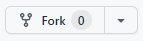

# Curso GIT: Desarrollo Colaborativo. *Educación IT*

## Configuración Inicial
``` js
1. Configurar nombre de usuario
> git config --global user.name "Mi Nombre de Usuario"

2.Configurar correo electrónico
> git config --global user.email "mail@ejemplo.com"

3. Verificar todas las configuraciones con
> git config --list

o también podemos consultar el valor de una variable en particular con

> git config user.name
> git config user.email
```
---

## Primeros pasos
``` js
1. En la carpeta que queramos que sea el repositorio local

> git init
> git remote add origin "Link del repositorio"
```

## Comandos útiles

```js
1. Ver el estado de los archivos
> git status

2. Agregar archivos al Stage area
> git add <nombre archivo>
> git add . (agrega todos los archivos)

3. Confirmar cambios(agregar archivos al track)
> git commit -m "Mensaje explicativo del commit"

4. Ver registro de cambios
> git log 
Muestra info detallada sobre todos los commits

> git log --oneline --graph
Muestra info más resumida

5.Guardar los archivos en el repositorio Local
> git push origin rama
```

---
## Branches (Ramas) 
Un branch o rama en GIT es un apuntador móvil apuntando a una de esas confirmaciones. Con la primera confirmación de cambios que realicemos, se creará la rama principal (master o main) apuntando a dicha confirmación. En cada confirmación de cambios que realicemos, la rama irá avanzando
automáticamente. Y la rama principal apuntará siempre a la última confirmación realizada.

## Comandos Branch

``` js
1.
>git branch //muestra las ramas del repo local
>git branch nombre-rama //crea una rama
>git branch -d nombre-rama //elimina una rama
 
2. Seleccionar una rama para trabajar
>git chechout nombre-rama
>git switch nombre-rama

3. Unir ramas
>git merge nombre-rama
```

---

## Clientes de git
```js
1. git clone <url> //obtenemos una copia de un repositorio git existente
```
### Fork
```
Cuando queremos contribuir a un proyecto al cual no tenemos permisos de escritura, podemos hacer un fork de dicho proyecto.

Para esto vamos a visitar la página del proyecto original y hacer click en el botón que dice “Fork”
```



```
Luego clickeamos en Create fork y seremos redigeridos  a la página de nuestro nuevo proyecto el cual contiene una copia exacta del original a la cual podemos hacerle cambios.
```

``` js
2. Actualizar repositorio remoto
//No integra el nuevo trabajo traído con el nuestro local
>git fetch <alias-remoto> //Trae información de cambios hechos por un colaborador
>git fetch origin //Si estamos trabajando con un repo clonado


2.1 Comando pull
//Descarga los nuevos cambios e intenta integrarlos
>git pull 


```